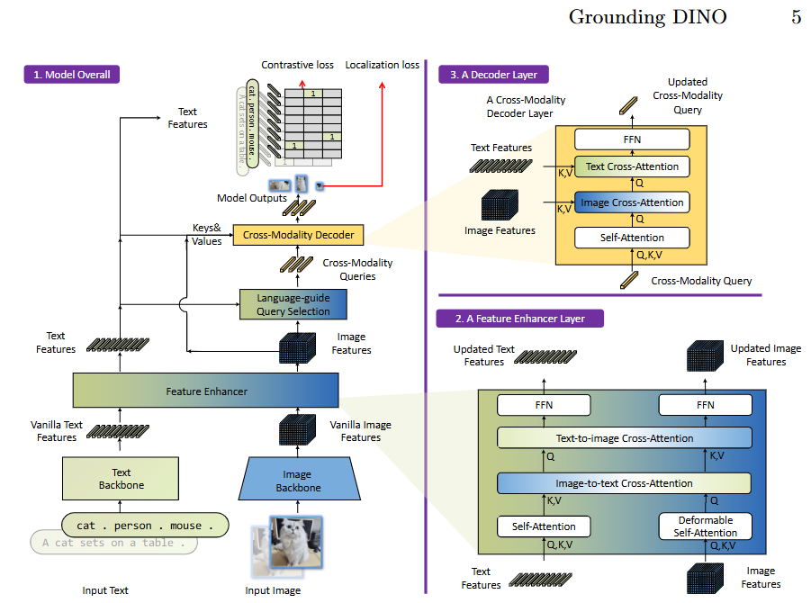

# Grounding DINO — Course Project Reproduction

This project reproduces the **Grounding DINO** open-vocabulary object detection and visual grounding pipeline described in:

> Liu et al., *"Grounding DINO: Marrying DINO with Grounded Pre-Training for Open-Set Object Detection"*, arXiv:2303.05499

**Goal:** Implement the inference and evaluation pipeline using the authors' **pretrained checkpoints**. We do **not** train from scratch — the focus is on architecture reproduction, benchmark evaluation, and result analysis.

---

## What This Project Does

Grounding DINO is a transformer-based detector that can locate arbitrary objects in an image given **text prompts** (category names or natural-language descriptions).


*Figure 3 from the paper: overall framework, feature enhancer layer, and decoder layer.*

The architecture has three main stages:

1. **Dual Backbone** — Swin Transformer extracts image features; BERT extracts text features.
2. **Feature Enhancer** — Cross-attention fuses image and text representations.
3. **Cross-Modality Decoder** — Refines detection queries using both image and text features to predict bounding boxes.

We evaluate the pretrained model on two standard benchmarks:

| Task | Dataset | Metric |
|------|---------|--------|
| **Open-Vocabulary Object Detection** | COCO 2017 val | AP / AP50 / AP75 |
| **Visual Grounding (REC)** | RefCOCO / RefCOCO+ / RefCOCOg | Accuracy (IoU > 0.5) |

---

## Project Structure

```
grounding_dino_project/
├── core/                          # Shared model architecture (read-only)
│   ├── backbones/                 # Swin-T (image) + BERT (text)
│   ├── neck/                      # Feature enhancer
│   ├── decoder/                   # Cross-modality decoder
│   ├── query_selection/           # Language-guided query selection
│   └── utils/                     # Hungarian matcher
│
├── shared_utils/                  # Box ops, text tokenization helpers
├── configs/                       # Hyperparameter configs
│   ├── base_config.py
│   ├── ovod_config.py             # Team 1 config
│   └── grounding_config.py        # Team 2 config
│
├── ovod/                          # Team 1 — Open-Vocabulary Detection
│   ├── datasets/
│   ├── models/
│   ├── losses/
│   └── train_eval/
│
├── visual_grounding/              # Team 2 — Visual Grounding
│   ├── datasets/
│   ├── models/
│   ├── losses/
│   └── train_eval/
│
├── tools/
│   └── load_checkpoint.py         # Maps official weights → our model
│
├── grounding_dino.py              # Main model definition
├── demo_inference.py              # Quick sanity-check script
├── visualize.py                   # Draw boxes on images for reports
└── README.md                      # This file
```

---

## 1. Environment Installation

### 1.1 Create Conda Environment

```bash
cd grounding_dino_project
conda env create -f environment.yml
conda activate grounding_dino
```

**If your server has a different CUDA version**, check with `nvidia-smi` and edit `pytorch-cuda=12.4` in `environment.yml` accordingly before creating.

### 1.2 Verify Installation

```bash
python -c "import torch; print(torch.__version__); print('CUDA:', torch.cuda.is_available())"
```

Expected output: PyTorch version + `CUDA: True`.

---

## 2. Download Pretrained Checkpoints

We use the official **GroundingDINO_SwinT_OGC** checkpoint (~660 MB). It is the best balance of size and performance for a course project.

```bash
mkdir -p ./pretrained_weights
wget -P ./pretrained_weights \
  https://github.com/IDEA-Research/GroundingDINO/releases/download/v0.1.0-alpha/groundingdino_swint_ogc.pth
```

**Optional (larger, stronger):**
```bash
# Swin-B variant (~1.2 GB)
wget -P ./pretrained_weights \
  https://github.com/IDEA-Research/GroundingDINO/releases/download/v0.1.0-alpha2/groundingdino_swinb_cogcoor.pth
```

---

## 3. Download Datasets

Create a shared data folder (outside the repo to avoid bloating it):

```bash
mkdir -p ./data
```

### 3.1 COCO 2017 (for OVOD evaluation)

```bash
cd ./data
mkdir -p coco && cd coco

# Images
wget http://images.cocodataset.org/zips/val2017.zip
unzip val2017.zip && rm val2017.zip

# Annotations
wget http://images.cocodataset.org/annotations/annotations_trainval2017.zip
unzip annotations_trainval2017.zip && rm annotations_trainval2017.zip
```

Final structure:
```
data/coco/
├── val2017/
└── annotations/
    └── instances_val2017.json
```

### 3.2 RefCOCO / RefCOCO+ / RefCOCOg (for Visual Grounding evaluation)

Download from the official repository:

```bash
cd ./data
git clone https://github.com/lichengunc/refer.git
```

Follow the instructions in `refer/README.md` to download the datasets and place them under:

```
data/refer/
├── refcoco/
├── refcoco+/
└── refcocog/
```

**Note:** RefCOCO uses the same COCO 2014/2017 train images. If you already downloaded COCO val2017, you do **not** need to download the COCO training images again unless the dataset loader specifically requires them.

---

## 4. Quick Start: Run Inference

### 4.1 Inspect Checkpoint Keys (optional debugging)

```bash
python tools/load_checkpoint.py --checkpoint ./pretrained_weights/groundingdino_swint_ogc.pth
```

This prints the checkpoint's internal key names so you can verify the weight mapper is working.

### 4.2 Sanity-Check Forward Pass

```bash
CUDA_VISIBLE_DEVICES=1 python demo_inference.py \
  --checkpoint ./pretrained_weights/groundingdino_swint_ogc.pth
```

If tensor shapes print without errors, your model + checkpoint loading pipeline is correct.

### 4.3 Visualize Predictions on a Single Image

```bash
CUDA_VISIBLE_DEVICES=1 python visualize.py \
  --checkpoint ./pretrained_weights/groundingdino_swint_ogc.pth \
  --image ./data/coco/val2017/000000000139.jpg \
  --text "person . car . dog ." \
  --output ./output_vis.jpg \
  --threshold 0.3
```

The output image `output_vis.jpg` will have red bounding boxes drawn around detected objects. Use these for your report figures.

---

## 5. Evaluation

### 5.1 Team 1 — Open-Vocabulary Object Detection (COCO)

```bash
CUDA_VISIBLE_DEVICES=1 python -m ovod.train_eval.eval_ovod \
  --checkpoint ./pretrained_weights/groundingdino_swint_ogc.pth \
  --data_root ./data
```

This runs zero-shot evaluation on COCO val2017 and reports AP / AP50 / AP75.

### 5.2 Team 2 — Visual Grounding (RefCOCO)

```bash
CUDA_VISIBLE_DEVICES=2 python -m visual_grounding.train_eval.eval_grounding \
  --checkpoint ./pretrained_weights/groundingdino_swint_ogc.pth \
  --data_root ./data
```

This runs referring expression comprehension evaluation and reports accuracy.

---

## 6. Team Division & Workspace Rules

We have 4 members divided into two sub-teams. To avoid file conflicts (we share one server without version control):

| Team | Members | Workspace | Task |
|------|---------|-----------|------|
| **Team 1** | 2 people | `ovod/` | Open-vocabulary detection on COCO / LVIS |
| **Team 2** | 2 people | `visual_grounding/` | Visual grounding on RefCOCO / RefCOCO+ / RefCOCOg |

### Critical Rules
1. **`core/` and `grounding_dino.py` are read-only.** Discuss before modifying.
2. Work **only** in your assigned directory.
3. Use **distinct checkpoint names** so you don't overwrite each other's files.
4. Coordinate GPU usage:
   - GPU 0: Often busy (avoid)
   - GPU 1: Team 1
   - GPU 2: Team 2

---

## 7. Expected Results (from Paper)

Use these as baselines to compare your reproduction:

### COCO Zero-Shot (GroundingDINO Swin-T, O365+GoldG pre-training)
| AP | AP50 | AP75 |
|----|------|------|
| 46.7 | ~ | ~ |

*(Refer to the paper Table 2 for exact numbers depending on training data configuration.)*

### RefCOCO / RefCOCO+ / RefCOCOg (GroundingDINO Swin-T)
| Dataset | Accuracy |
|---------|----------|
| RefCOCO testA | ~85% |
| RefCOCO+ testA | ~79% |
| RefCOCOg test | ~83% |

*(Refer to the paper Table 4 for exact numbers.)*

---

## 8. Troubleshooting

### `ModuleNotFoundError: No module named 'timm'` or `'transformers'`
```bash
conda activate grounding_dino
pip install timm transformers
```

### Checkpoint keys don't match / many missing keys
Run the inspection script to see the exact key names:
```bash
python tools/load_checkpoint.py --checkpoint <path>
```
Then update `tools/load_checkpoint.py` → `build_key_mapping()` if needed.

### CUDA out of memory during inference
- Reduce `image_size` in `configs/base_config.py` (e.g., 800 → 640)
- Reduce `num_queries` (e.g., 900 → 300)
- Use `CUDA_VISIBLE_DEVICES=1` to pick a free GPU

---

## 9. Report Checklist

Your final report should include:
- [ ] Architecture diagram (use our `core/` structure as reference)
- [ ] Quantitative results tables vs. paper
- [ ] Qualitative visualizations (`visualize.py` outputs)
- [ ] Discussion of failure cases
- [ ] Contribution section per team member (e.g., 35% Alice, 25% Bob, ...)
